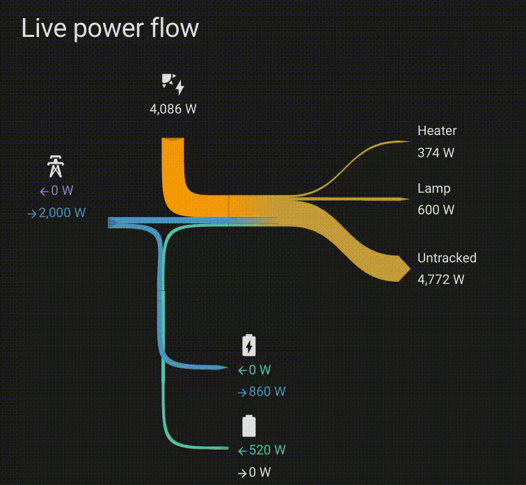

# Home Assistant Energy Sankey Cards

[![GitHub Release][releases-shield]][releases]

[![License][license-shield]](LICENSE.md)

Energy Sankey is a collection of dashboard cards for homeassistant, dynamically displaying the flow of electrical energy and power.

The cards are ideal if you want to track your electricity consumption and identify where your energy is going.

The aim is for as easy setup as possible. No configuring groups of child entities, complicated choices or hunting for info to populate a yaml configuration. In most cases, the default configuration should just work.

There are two main cards:
 - a card showing the total _energy_ flow based on a configurable* time range (e.g. day so far).
 - a user configurable card showing the _power_ flow for a set of sensors. This represents the live power flow at the current moment.

Both cards base their configuration on the existing home assistant energy configuration, and use the same colour scheme.

Both are live and automatically updating. The cards try to display a coherent representation even if the data set is incomplete or physically impossible (e.g. exporting more than generation + batteries are outputting). This means it is ok for asynchronous updates to be made to any of the entities the card is monitoring, and they can have different update intervals.

The width of the flows represents the amount, and the overall size of everything is automatically scaled so that no one part of the diagram becomes too wide.

The colour* of the flows heading to the consumers represents the blend of locally generated vs grid energy.

The diagram dynamically scales to fit the size of the window it is in (mostly).

## Installation (the easy way)

If you've already installed HACS (https://hacs.xyz/), click this button and then click download!

## Installation via HACS
 - Install HACS in your Home Assisstant installation (see https://hacs.xyz/ for detailed instructions)
 - Navigate to HACS within your Home Assistant instance (Menu > HACS)
 - In the search box type 'Energy Sankey'
 - Click on **Energy Sankey Card**
 - Click Download
 - Reload when prompted
 - Select a dashboard and enter editing mode
 - Type 'Sankey' in the search box
 - Select 'Sankey Energy Flow Card' or 'Sankey Power Flow Card'
   - The energy card does not require configuration
   - The power card auto configures. If there are any problems with autoconfiguration, use built in card editor to select the correct power entities for grid input / generation / consumers / batteries.

## Outstanding issues to solve:
- [ ] Sometimes there are thin dark lines between the blocks that make up the shapes, I believe this is caused by antialiasing, but I don't see an easy way of reducing/eliminating it, especially where the shapes are across two divs.
- [ ] There are probably more edge cases to experiment with, such as multiple generation sources, grid configured with only input or output, and either of those being negative to represent flow in the opposite direction.
- [ ] *Configurable time range is not yet implemented

[license-shield]: https://img.shields.io/github/license/davet2001/homeassistant-energy-sankey-card.svg?style=for-the-badge
[releases-shield]: https://img.shields.io/github/release/davet2001/homeassistant-energy-sankey-card?style=for-the-badge
[releases]: https://github.com/davet2001/homeassistant-energy-sankey-card/releases
